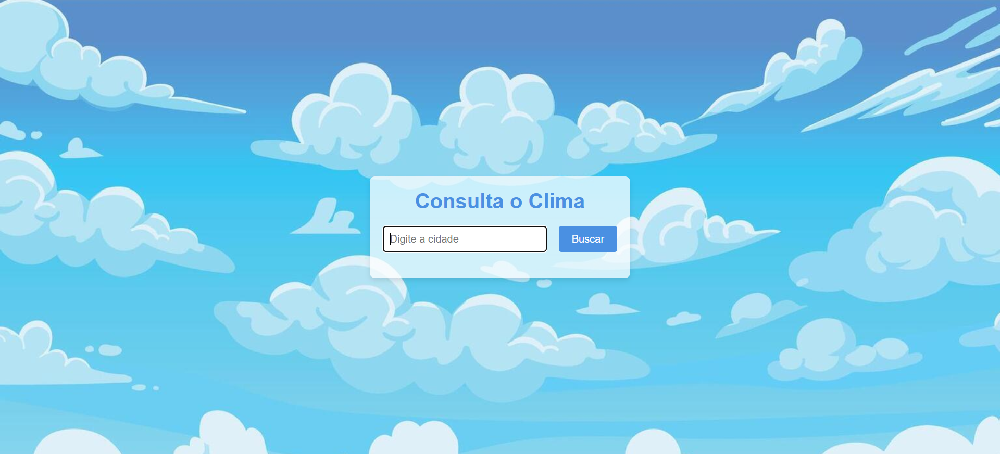
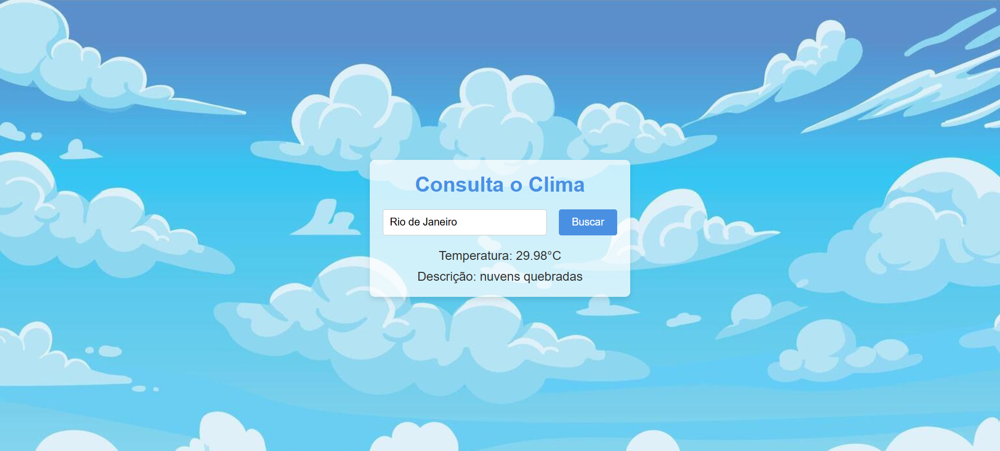

# 🌤️ App de Consulta de Clima

> Aplicação web simples para consulta de condições meteorológicas em tempo real.

## 💻 Sobre o Projeto

Este projeto foi desenvolvido para praticar o consumo de **APIs Externas** utilizando JavaScript puro. O objetivo foi criar uma interface limpa onde o usuário insere o nome de uma cidade e recebe instantaneamente a temperatura e a descrição do clima.

O foco principal do estudo foi:
* Manipulação do DOM (capturar inputs e atualizar textos).
* Requisições assíncronas (`fetch`, `async`/`await`).
* Tratamento de estados da aplicação (ex: exibir "Carregando...").

## ✨ Funcionalidades

* **Busca por Cidade:** Campo de texto para digitar o local desejado.
* **Feedback de Carregamento:** Mensagem visual enquanto os dados estão sendo buscados.
* **Exibição de Dados:** Mostra a temperatura atual e a descrição do clima (ex: "Céu limpo", "Nublado").

## 📸 Screenshot

  
  

---

## 🛠 Tecnologias Utilizadas

* **HTML5:** Estrutura da página.
* **CSS3:** Estilização dos elementos (arquivo `style.css`).
* **JavaScript:** Lógica de busca e conexão com a API de clima (arquivo `script.js`).

## 🚀 Como rodar o projeto

1.  Clone este repositório.
2.  Abra o arquivo `index.html` no seu navegador.
3.  Digite o nome de uma cidade e clique em "Buscar".

## 👩‍💻 Autora

**Isabelle Pantoja**

---
*Projeto de estudo Front-end.* ☁️
